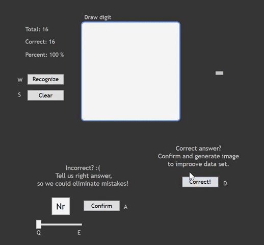

# Neural-Network
Artificial Multilayer Neural Network from scratches.

## Digit recognition
Recognizes digit drawn by a user and appends it to training data.
Network trained on very small data set of 200 images generated manually, performs with 95% accuracy.
In such a small dataset, the result may be sensitive to differences between the user's handwriting and the creator's of the dataset.

